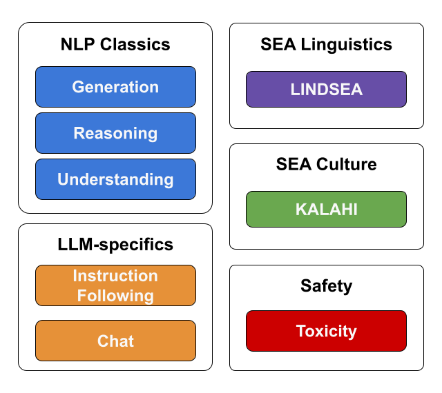

<!-- markdownlint-disable-file MD033 MD040 MD041 -->

<div align="center">

# SEA-HELM

<p align="center">
   <strong>An open and comprehensive evaluation suite for SEA languages</strong><br>
</p>

[📊 Leaderboard](https://leaderboard.sea-lion.ai/) |
[🌐 About Us](https://sea-lion.ai/)

[](https://arxiv.org/abs/2502.14301)

</div>

> [!IMPORTANT]  
> **Join Us in Advancing LLM evaluations for the SEA Region**
>
> We're committed to delivering frequent updates and comprehensive evaluations that advance LLM performance across Southeast Asian languages. Here's how you can contribute:
>
> - **For Language Experts**: Have expertise in SEA languages? We are happy to collaborate with you to build more robust evaluations.
> - **For Researchers & Organizations**: If SEA-HELM supports your work, please:
>   - ⭐ Star this repository to help us demonstrate impact to stakeholders
>   - 📄 Cite our work in your publications ([see citation](#citation))
>   - 🤝 Contact us to explore partnership opportunities, including joint press releases
>
> Your engagement directly supports the sustainability and growth of this project.

## 🎉 Latest Updates

<details open>
<summary><strong>20 Jan 2026</strong></summary>

<strong>Changelog:</strong>

1. SEA-HELM now uses a multple run evaluation methodology. A total of 8 runs are used for the leaderboard with each run using the default generation kwargs provided by each model provider.
1. Added helper jupyter notebooks for evaluation integrity (`helpers/result_integrity_status.ipynb`) and score aggregation (`helpers/results_aggregation.ipynb`)
1. Added ELO calculation script
1. New languages:
   - Malay
   - Burmese
   - Lao (Sentiment, MCQA, Translation, SEA-IFEval, SEA MT-Bench)
   - Khmer (MCQA, SEA-IFEval and SEA MT-Bench)
1. New task categories:
   - Knowledge
   - Vision
1. Inference and evaluation backbones have been updated with various QoL features: Lazy loading of models, local and remote judge models, custom dataloaders, and cache model judgements.
1. Core datasets have been migrated to Huggingface. The remainder will be moved in a later update.
1. Added scripts to be used with job schedulers.

<strong>Credits:</strong>

- Burmese - [@ThuraAung1601](https://github.com/ThuraAung1601)
- Lao - [@malaythong](https://github.com/malaythong), [@jnaynay](https://github.com/jnaynay)
- Khmer - [@yslidet](https://github.com/yslidet)

</details>

## Overview

SEA-HELM (SouthEast Asian Holistic Evaluation of Language Models) is an assessment of large language models (LLMs) across various tasks, emphasizing Southeast Asian languages.

This suite consist of 5 core pillars to evaluate the performance of LLMs across a range of key capabilities in the SEA languages:

1. NLP Classics
1. LLM-specifics
1. SEA Linguistics
1. SEA Culture
1. Safety



Results from SEA-HELM can be found on the SEA-HELM leaderboard at [https://leaderboard.sea-lion.ai/](https://leaderboard.sea-lion.ai/).

> [!NOTE]  
> BHASA has been integrated into SEA-HELM

## Evaluating Models using SEA-HELM

### Setup environment for SEA-HELM

We suggest users to use `uv` to run SEA-HELM:

1. Install the virtual environment using `uv sync`
1. Ensure that the appropriate HF_TOKEN has been set in the environment (with access to gated models).

> [!NOTE]  
> **Running LLM-as-a-Judge for MT-bench**  
> SEA-HELM currently uses `gpt-4.1-2025-04-14` as the Judge LLM. As such, there is a need to access the OpenAI servers. Please ensure that `OPENAI_API_KEY` environment variable is set.
>
> ```bash
> export OPENAI_API_KEY=...
> ```

> [!NOTE]  
> **Translation evaluation using deep learning based models**  
> To run the evaluation with MetricX models please ensure that you have access to the following MetricX models on Huggingface.
>
> - MetricX-24 (XXL, bfloat16): [https://huggingface.co/google/metricx-24-hybrid-xxl-v2p6-bfloat16](https://huggingface.co/google/metricx-24-hybrid-xxl-v2p6-bfloat16)

### Instructions for running SEA-HELM

<details open>

<summary><strong>(Recommended) Option 1: Running using the provided job scheduler script (PBS / SLURM)</strong></summary>

All the scheduler scripts are set to 8 runs automatically. Please remember to set an appropriate number of gpus/cpus/memory per run. Please also set any cluster specific configurations like project ids and job queues.

To run the evaluation on PBS:

```bash
qsub -v MODEL=<model> run_evaluation.pbs
```

To run the evaluation on SLURM:

```bash
sbatch --export=ALL,MODEL=<model_name> run_evaluation.slurm
```

</details>

<details open>

<summary><strong>Option 2: Running using the provided bash script</strong></summary>

To run the evaluation:

1. Specify the path to the output directory (for the model generations, results JSON and log files) as well as the models to be evaluated in `run_evaluation.sh`
1. Then run the evaluation with the following command:

```bash
bash run_evaluation.sh -m <model_name> -o ./results -t seahelm --run-number 0 --model-type vllm
```

</details>

<details>

<summary><strong>Option 3: Running SEA-HELM directly using the CLI</strong></summary>

SEA-HELM can be run using the following bash command by replacing

1. `<model_name>` with the desired huggingface model id or a local folder containing a huggingface model
1. `<output_dir>` with the local folder to save the run config and results

The command will run inference on the desired model with vLLM using a single gpu.

> ```bash
> uv run seahelm_evaluation.py --tasks seahelm --output_dir <output_dir> --model_type vllm --model_name <model_name> --model_args "enable_prefix_caching=True,tensor_parallel_size=auto"
> ```

</details>

> [!TIP]
>
> 1. `--model_args` takes any kwargs specified in [https://docs.vllm.ai/en/latest/configuration/engine_args/](https://docs.vllm.ai/en/latest/configuration/engine_args/) and allows for control of how vLLM serves the model.
> 1. `--tensor_parallel_size` can be set to `auto` and the script will utilize all the GPUs available
> 1. `--tasks` can be specified multiple times e.g. `--tasks seahelm --tasks vision`. All the tasks in both configurations will be run at the same time.

### Important notes about running SEA-HELM

1. **🌟 NEW:** SEA-HELM evaluations are done over 8 independent runs per model.
   - _Please remember to run the evaluation with different seeds and set the corresponding run numbers if you are using the bash script_
1. Please ensure that the `--base_model` flag is included if the model to be evaluated is a base model. This will load a default base model chat template (see [chat_templates/base_model.jinja](chat_templates/base_model.jinja)). The `--base_model` will also disable the MT-Bench tasks.
1. All inference results and any model based judgements (LLM-as-a-judge, MetricX) are cached in the results folder to allow for resumption of incomplete runs.
   - If there is a need to rerun the inference, please either delete the corresponding model folder in the results folder or set the flag `--rerun_cached_results`
1. LLM-as-a-Judge in SEA-MT-Bench
   - The OpenAI calls are currently performed using the OpenAI's Batch API to save cost. This might result in a small increase in the wait times depending on the load of the OpenAI servers.
   - If present as a task to run, MT-Bench is run as the first task so as to allow for the judgements to be done while the rest of the evaluations are being done.

---

## Links to find out more

- For the details on how to customize the evaluation run using the command line, please refer to [Command Line Interface](docs/cli.md).
- For the evaluation datasets used, please refer to [Datasets and Prompts](docs/datasets_and_prompts.md).
- For details on the score normalisation and aggregation process, please refer to [Score Calculations](docs/score_calculations.md).
- For details on the folder structure of this repo, please refer to [Folder Structure](docs/seahelm_folder_structure.md).
- For details on how to add a new task, please refer to [New Task Guide](docs/new_task_guide.md).
- For details on the model serving frameworks, please refer to [Model Serving](docs/serving_models.md)

## Other References

1. Leong, W. Q., Ngui, J. G., Susanto, Y., Rengarajan, H., Sarveswaran, K., & Tjhi, W. C. (2023). Bhasa: A holistic southeast asian linguistic and cultural evaluation suite for large language models. arXiv preprint [arXiv:2309.06085](https://arxiv.org/abs/2309.06085).
   - Code: [https://github.com/aisingapore/BHASA](https://github.com/aisingapore/BHASA)
2. Montalan, J. R., Ngui, J. G., Leong, W. Q., Susanto, Y., Rengarajan, H., Aji, A. F., & Tjhi, W. C. (2024). Kalahi: A handcrafted, grassroots cultural LLM evaluation suite for Filipino. arXiv preprint [arXiv:2409.15380](https://arxiv.org/abs/2409.15380).
3. Montalan, J. R., Layacan, J. P., Africa, D. D., Flores, R. I. S., Ii, M. T. L., Magsajo, T. D., Cayabyab, A., & Tjhi, W. C. (2025, July). BATAYAN: A Filipino NLP benchmark for evaluating Large Language Models. In Proceedings of the 63rd Annual Meeting of the Association for Computational Linguistics (Volume 1: Long Papers) (pp. 31239-31273). [10.18653/v1/2025.acl-long.1509](10.18653/v1/2025.acl-long.1509)

## License

The codes for SEA-HELM is licensed under the MIT license. All datasets are licensed under their respective licenses. Please see [Datasets and Prompts](docs/datasets_and_prompts.md) for the full list of licenses.

## Citation

If you use this evaluation suite in your research, please cite the [SEA-HELM](https://arxiv.org/abs/2502.14301) paper:

```
@misc{susanto2025seahelmsoutheastasianholistic,
      title={SEA-HELM: Southeast Asian Holistic Evaluation of Language Models},
      author={Yosephine Susanto and Adithya Venkatadri Hulagadri and Jann Railey Montalan and Jian Gang Ngui and Xian Bin Yong and Weiqi Leong and Hamsawardhini Rengarajan and Peerat Limkonchotiwat and Yifan Mai and William Chandra Tjhi},
      year={2025},
      eprint={2502.14301},
      archivePrefix={arXiv},
      primaryClass={cs.CL},
      url={https://arxiv.org/abs/2502.14301},
}
```
